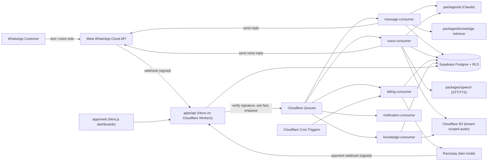

# Architecture Overview — Dravonix WhatsApp AI Platform

## System context



## Layering

```
apps/web        Next.js dashboards (client + super-admin), server-side authorized
apps/api        Hono HTTP API on Cloudflare Workers: webhooks, REST endpoints, auth
apps/workers/*  Queue consumers: message, voice, billing, knowledge, notification

packages/core           shared types, Result/Error helpers, state machines
packages/config         env validation + centralized branding
packages/database       Supabase client factories + generated types
packages/auth           Supabase Auth session + server-side authorization helpers
packages/tenant         tenant context, membership + permission resolution
packages/whatsapp       WhatsApp provider interface, Graph API + mock adapters
packages/ai             AI provider interface, Claude + mock adapters, prompt/schema
packages/speech         STT/TTS provider interfaces, Google + mock adapters
packages/billing        subscription state machine, Razorpay adapter, entitlements
packages/knowledge      ingestion pipeline + retriever abstraction
packages/notifications  notification provider interface (in-app/email/WA template)
packages/observability  structured logging, redaction, correlation IDs
packages/validation     shared zod schemas
packages/storage        storage provider interface, R2 + mock adapters
packages/ui             shared React components + branding-aware theme
```

Business logic lives in `packages/*` domain services. `apps/api` route handlers and
`apps/workers/*` consumers are thin: parse input, resolve tenant/auth context, call a
domain service, return/enqueue. This keeps the same domain logic reachable from HTTP
routes, queue consumers, and tests without duplication.

## Request flow: inbound WhatsApp text message

1. Meta POSTs the webhook to `apps/api`. The route verifies `X-Hub-Signature-256`
   using `META_APP_SECRET` (`packages/whatsapp/src/signature.ts`).
2. The route resolves the destination `phone_number_id` to a `company_id`
   (`packages/whatsapp/src/routing.ts`). Unknown phone-number IDs are stored in
   `webhook_events` with `status = "unrouted"` and acknowledged — never dropped
   silently, never processed as if trusted.
3. The event is deduplicated against `webhook_events.provider_event_id` /
   `messages.provider_message_id` (both unique). Duplicate deliveries return 200
   immediately without re-enqueueing.
4. The webhook responds `200 OK` immediately; the actual work (entitlement check →
   knowledge retrieval → Claude call → validation → send) happens in
   `message-consumer`, which re-validates the company's subscription/suspension
   state before doing anything chargeable — see `docs/architecture/adr-0006-billing-state-machine.md`
   and `docs/architecture/adr-0002-webhook-architecture.md`.
5. The consumer stores the outbound message and calls the WhatsApp send adapter.
   Message state transitions (`sent → delivered → read/failed`) arrive as further
   webhook events and are applied idempotently by `provider_message_id`.

## Multi-tenancy enforcement points

See `docs/architecture/adr-0001-multi-tenant-strategy.md` for the full rationale.
In short: every tenant-owned table has `company_id NOT NULL` + RLS; every queue
payload embeds and re-validates `company_id`; every storage key is prefixed
`companies/{company_id}/...`; every log line carries `company_id`; every AI/knowledge
call takes an explicit tenant-scoped repository, never a global query.
